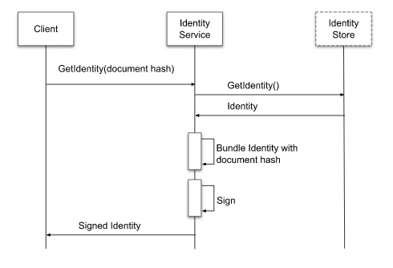

# Table of Contents
+ [About this application](#about-this-application)
  + [The Identity](#the-identity)
  + [The Document Hash](#the-document-hash)
  + [The Signed Identity](#the-signed-identity)
  + [Sequence Diagram](#sequence-diagram)
+ [How to execute](#how-to-execute)
  + [Environment Variables](#environment-variables)
  + [Installing Dependencies](#installing-dependencies)
  + [Running the app](#running-the-app)
  + [Running tests](#running-tests)
  + [Building the app](#building-the-app)
+ [Available Endpoints](#available-endpoints)
  + [GET `/health`](#get-health)
  + [POST `/identities/sign`](#post-identitiessign)

# About this application

This API will sign documents using the [ECDSA algorithm](https://en.wikipedia.org/wiki/Elliptic_Curve_Digital_Signature_Algorithm).

The main concepts to understand this app are:

1. [The Identity](#the-identity)
2. [The Document Hash](#the-document-hash)
3. [The Signed Identity](#the-signed-identity)

### The `Identity`

The identity reflects a user and it has the following attributes:

+ Id
+ First Name
+ Last Name
+ Date of birth

There is an Identity Store (hardcoded inside the `IdentityRepository`) where you can retrieve identities.

### The `Document Hash`

To keep privacy, the app doesn't know anything about the document being singed, it only needs a document hash.
The `document hash` is a SHA512 of the document being signed.

### The `Signed Identity`

When an `Identity` requests to sign a `Document Hash`, a new `Signed Identity` is created.
The `Signed Identity` is composed of:

+ `Identity` - The `identity` that requested the signature.
+ `Document Hash` - The `document` being signed (SHA512).
+ `Signature` - The ECDSA signature, which is created based on a SHA512 hash of `Identity` and `Document Hash`.

## Sequence Diagram


# How to execute

### Environment Variables

To run this application, you'll need to setup the environment variables described in the file `.env.template`. You can create them in a file called `.env`.

### Installing dependencies

To install the required dependencies run:
```bash
go mod tidy
```

### Running the app

Run the command:
```bash
go run .
```

### Running tests

You can run the unit tests by executing:
```bash
go test ./... -v
```

### Building the app

You can build the app by running:
```bash
go build -o bin/app
```

This will give you an executable file that you can run on you platform.

# Available endpoints

### GET `/health`

This is a healthcheck endpoint to make sure the app is up and running.

### POST `/identities/sign`

This endpoint will sign a document for an identity.

The request body must be a json like the following:

```json
{
    "identityId": "string", // the ID of the identity requesting the signature
    "documentHash": "string" // the SHA512 of the document to be signed
}
```

The possible responses are:

+ `201`: The signing was successful, you'll receive a json
containing the respective [Signed Identity](#the-signed-identity).
+ `400`: The request body is invalid.
+ `404`: The identity requesting the signature cannot be found in the Identity Store.
+ `500`: A signing error or another unexpected error occurred.